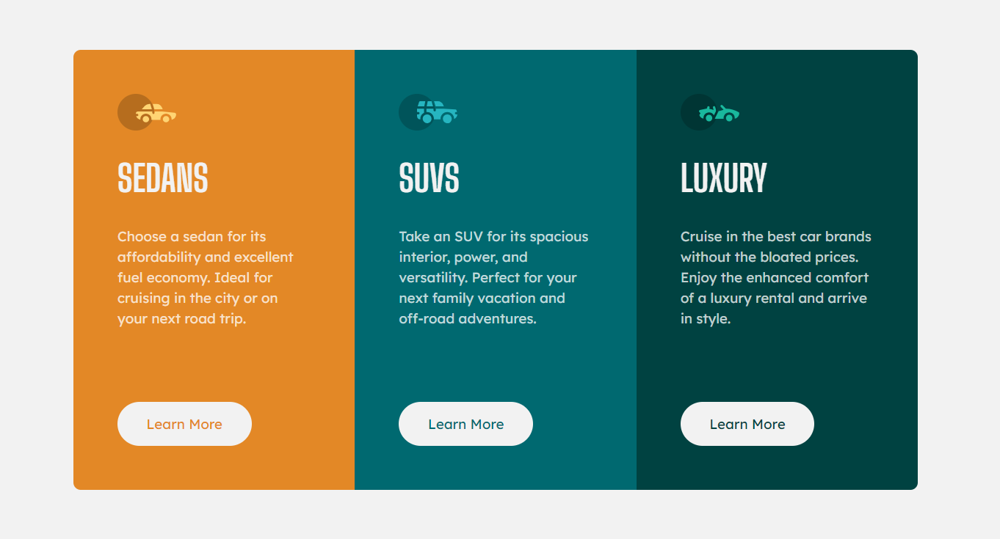

# Welcome! 👋

**"Thanks for checking out this front-end coding challenge."**

# Frontend Mentor - 3-column preview card component solution

- Implemented with pure HTML & Css.

## Table of contents

- [Overview](#overview)
  - [The challenge](#the-challenge)
  - [Screenshot](#screenshot)
  - [Links](#links)
- [My process](#my-process)
  - [Built with](#built-with)
  - [What I learned](#what-i-learned)
  - [Continued development](#continued-development)
  - [Useful resources](#useful-resources)
- [Author](#author)
- [Acknowledgments](#acknowledgments)

## Overview

### The challenge

Users should be able to:

- View the optimal layout depending on their device's screen size
- See hover states for interactive elements

### Screenshot

### Links

- Solution URL: [Click to check my solution at Frontend Mentor]()
- Live Site URL: [Click to check the live site](https://cgm-thanhtike.github.io/3-column-preview-card-component-with-grid/)

## My process

- I'm pretty comfortable with design and think to go with mobile first approach as this one has 3 column layout on desktop and 1column on mobile.

### Built with

- Semantic HTML5 markup
- CSS custom properties
- Flexbox
- CSS Grid

### What I learned

I learned how gird is easy to wrok with in this kind of layout.

## Author

- Website - [My git-hub profile](https://github.com/CGM-ThanHtike)
- Frontend Mentor - [My Frontend Mentor profile](https://www.frontendmentor.io/profile/CGM-ThanHtike)

**Thank you all!** 🚀